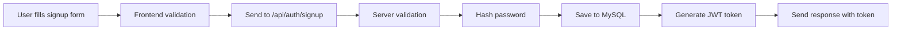
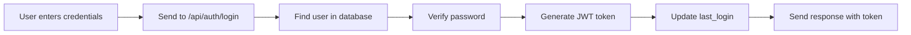
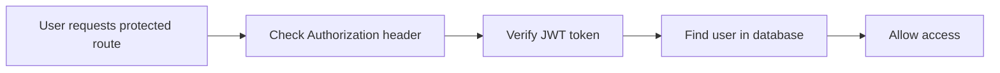

# Homeware On Tap 🏠

<div align="center">
  
  
  **Quality Homeware Delivered - Your Home Essentials, On Tap**
  
  [](https://mysql.com/)
  [](https://nodejs.org/)
  [](https://expressjs.com/)
  [](https://jwt.io/)
</div>

---

## 🌟 What is Homeware On Tap?

Homeware On Tap is a modern e-commerce platform specializing in quality homeware products. This project features a complete authentication system with MySQL database integration, allowing users to register, login, and manage their accounts securely.

## 🚀 Features

### 🔐 **Authentication System**
- **User Registration** - Complete signup form with validation
- **Secure Login** - JWT-based authentication
- **Password Security** - Bcrypt hashing with salt rounds
- **Session Management** - Persistent login sessions
- **Profile Management** - Update user information

### 🛡️ **Security Features**
- **Rate Limiting** - Prevents brute force attacks
- **CORS Protection** - Cross-origin request security
- **Input Validation** - Server-side data validation
- **SQL Injection Prevention** - Parameterized queries
- **Helmet Security** - HTTP headers protection

### 🎨 **Frontend Features**
- **Responsive Design** - Mobile-first approach
- **Interactive Forms** - Real-time validation
- **Modern UI** - Clean and intuitive interface
- **Shopping Cart** - Product management system
- **User Dashboard** - Account management

## 🏗️ Project Architecture

```
homeware-on-tap/
├── 🖥️ Frontend (HTML/CSS/JavaScript)
│   ├── index.html              # Homepage
│   ├── login.html              # Login page
│   ├── signup.html             # Registration page
│   ├── checkout.html           # Checkout process
│   └── assets/
│       ├── css/styles.css      # Styling
│       ├── js/
│       │   ├── script.js       # Main functionality
│       │   ├── auth.js         # Authentication handler
│       │   └── cart.js         # Shopping cart logic
│       └── img/                # Images and logo
│
├── 🔧 Backend (Node.js/Express)
│   ├── server.js               # Main server file
│   ├── config/
│   │   └── database.js         # MySQL connection
│   ├── models/
│   │   └── User.js             # User data model
│   ├── routes/
│   │   └── auth.js             # Authentication routes
│   ├── middleware/
│   │   └── auth.js             # JWT middleware
│   ├── package.json            # Dependencies
│   └── .env                    # Environment variables
│
└── 🗄️ Database (MySQL)
    └── setup.sql               # Database schema
```

## 📊 Database Schema

### 👤 Users Table
```sql
CREATE TABLE users (
    id INT AUTO_INCREMENT PRIMARY KEY,
    first_name VARCHAR(50) NOT NULL,
    last_name VARCHAR(50) NOT NULL,
    email VARCHAR(100) UNIQUE NOT NULL,
    phone VARCHAR(20) NOT NULL,
    password_hash VARCHAR(255) NOT NULL,
    date_of_birth DATE,
    address VARCHAR(255),
    city VARCHAR(100),
    province VARCHAR(50),
    postal_code VARCHAR(10),
    created_at TIMESTAMP DEFAULT CURRENT_TIMESTAMP,
    updated_at TIMESTAMP DEFAULT CURRENT_TIMESTAMP ON UPDATE CURRENT_TIMESTAMP,
    is_active BOOLEAN DEFAULT TRUE,
    email_verified BOOLEAN DEFAULT FALSE,
    last_login TIMESTAMP NULL
);
```

### 🔑 Sessions Table
```sql
CREATE TABLE user_sessions (
    id INT AUTO_INCREMENT PRIMARY KEY,
    user_id INT NOT NULL,
    session_token VARCHAR(255) UNIQUE NOT NULL,
    expires_at TIMESTAMP NOT NULL,
    created_at TIMESTAMP DEFAULT CURRENT_TIMESTAMP,
    ip_address VARCHAR(45),
    user_agent TEXT,
    FOREIGN KEY (user_id) REFERENCES users(id) ON DELETE CASCADE
);
```

## 🚦 API Endpoints

### Authentication Routes (`/api/auth`)

| Method | Endpoint | Description | Authentication |
|--------|----------|-------------|---------------|
| `POST` | `/signup` | Register new user | ❌ |
| `POST` | `/login` | User login | ❌ |
| `GET` | `/profile` | Get user profile | ✅ |
| `PUT` | `/profile` | Update profile | ✅ |
| `POST` | `/change-password` | Change password | ✅ |
| `POST` | `/logout` | Logout user | ✅ |

### Example API Usage

**Register a new user:**
```javascript
POST /api/auth/signup
Content-Type: application/json

{
  "firstName": "John",
  "lastName": "Doe",
  "email": "john.doe@example.com",
  "phone": "+27123456789",
  "password": "SecurePass123",
  "confirmPassword": "SecurePass123",
  "city": "Johannesburg",
  "province": "gauteng"
}
```

**Login:**
```javascript
POST /api/auth/login
Content-Type: application/json

{
  "email": "john.doe@example.com",
  "password": "SecurePass123"
}
```

## 🔧 Installation & Setup

### Prerequisites
- **Node.js** (v14 or higher)
- **MySQL** (v8.0 or higher)
- **npm** (comes with Node.js)

### Step 1: Clone the Repository
```bash
git clone https://github.com/Noita-Voni/HomewareOnTap.git
cd HomewareOnTap/homeware-on-tap
```

### Step 2: Database Setup
```sql
-- Create database
CREATE DATABASE homeware_on_tap;

-- Run the setup script
mysql -u your_username -p homeware_on_tap < database/setup.sql
```

### Step 3: Backend Setup
```bash
cd backend

# Install dependencies
npm install

# Create environment file
cp .env.example .env

# Edit .env with your database credentials
DB_HOST=localhost
DB_USER=your_mysql_username
DB_PASSWORD=your_mysql_password
DB_NAME=homeware_on_tap
JWT_SECRET=your_secure_jwt_secret

# Start the server
npm run dev
```

### Step 4: Frontend Setup
```bash
# Serve the frontend (choose one option)

# Option 1: Using Python
python -m http.server 8000

# Option 2: Using Node.js live-server
npx live-server

# Option 3: Using VS Code Live Server extension
# Right-click on index.html and select "Open with Live Server"
```

## 🌐 How It Works

### 1. **User Registration Flow**


### 2. **User Login Flow**


### 3. **Authentication Protection**


## 🎯 Key Technologies

| Technology | Purpose | Why We Use It |
|------------|---------|---------------|
| **MySQL** | Database | Reliable, ACID compliant, perfect for user data |
| **Node.js** | Backend Runtime | JavaScript everywhere, great performance |
| **Express.js** | Web Framework | Fast, minimalist, extensive middleware |
| **JWT** | Authentication | Stateless, secure, scalable |
| **Bcrypt** | Password Hashing | Industry standard, salt + hash |
| **CORS** | Security | Cross-origin request protection |
| **Helmet** | Security | HTTP headers protection |

## 🔒 Security Measures

### Password Security
- **Bcrypt hashing** with 12 salt rounds
- **Minimum 8 characters** with complexity requirements
- **Password confirmation** validation

### API Security
- **Rate limiting** (100 requests per 15 minutes)
- **CORS protection** with allowed origins
- **Input validation** and sanitization
- **SQL injection prevention** with parameterized queries

### Session Management
- **JWT tokens** with 24-hour expiration
- **Secure token storage** in localStorage
- **Automatic logout** on token expiration

## 🚀 Getting Started

1. **Register an account** at `/signup.html`
2. **Login** at `/login.html`
3. **Browse products** on the homepage
4. **Add items to cart** and proceed to checkout
5. **Manage your profile** with the account system

## 🛠️ Development

### Environment Variables
```env
# Database
DB_HOST=localhost
DB_USER=root
DB_PASSWORD=your_password
DB_NAME=homeware_on_tap
DB_PORT=3306

# JWT
JWT_SECRET=your_super_secret_key
JWT_EXPIRES_IN=24h

# Server
PORT=3001
NODE_ENV=development

# Security
RATE_LIMIT_WINDOW_MS=900000
RATE_LIMIT_MAX_REQUESTS=100
```

### Available Scripts
```bash
# Backend
npm start          # Start production server
npm run dev        # Start development server with nodemon
npm test           # Run tests

# Frontend
# Serve using your preferred method (Live Server, Python, etc.)
```

## 📱 Responsive Design

The application is fully responsive and works on:
- 📱 **Mobile devices** (phones, small tablets)
- 💻 **Desktop computers** (laptops, monitors)
- 📟 **Tablets** (iPads, Android tablets)

## 🤝 Contributing

1. Fork the repository
2. Create a feature branch (`git checkout -b feature/amazing-feature`)
3. Commit your changes (`git commit -m 'Add amazing feature'`)
4. Push to the branch (`git push origin feature/amazing-feature`)
5. Open a Pull Request

## 📄 License

This project is licensed under the MIT License - see the [LICENSE](LICENSE) file for details.

## 👨‍💻 Author

**Homeware On Tap Team**
- GitHub: [@Noita-Voni](https://github.com/Noita-Voni)
- Repository: [HomewareOnTap](https://github.com/Noita-Voni/HomewareOnTap)

## 🙋‍♂️ Support

If you have any questions or need help:

1. Check the [Authentication Setup Guide](README-AUTHENTICATION.md)
2. Open an issue on GitHub
3. Review the troubleshooting section below

## 🔧 Troubleshooting

### Common Issues

**❌ Database connection failed**
```bash
# Check if MySQL is running
brew services list | grep mysql  # macOS
services.msc                     # Windows

# Verify credentials in .env file
# Make sure database 'homeware_on_tap' exists
```

**❌ CORS errors**
```javascript
// Make sure your frontend URL is in corsOptions
const allowedOrigins = [
    'http://localhost:5500',  // Add your frontend URL here
    'http://127.0.0.1:5500'
];
```

**❌ Registration not working**
```bash
# Check server console for errors
# Verify all required fields are filled
# Check network tab in browser developer tools
```

---

<div align="center">
  
  
  **Made with ❤️ for your home**
  
  [🏠 Homepage](index.html) • [🔐 Login](login.html) • [📝 Register](signup.html)
</div>
